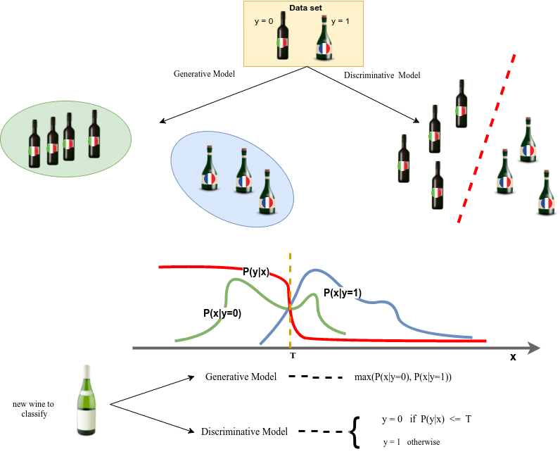
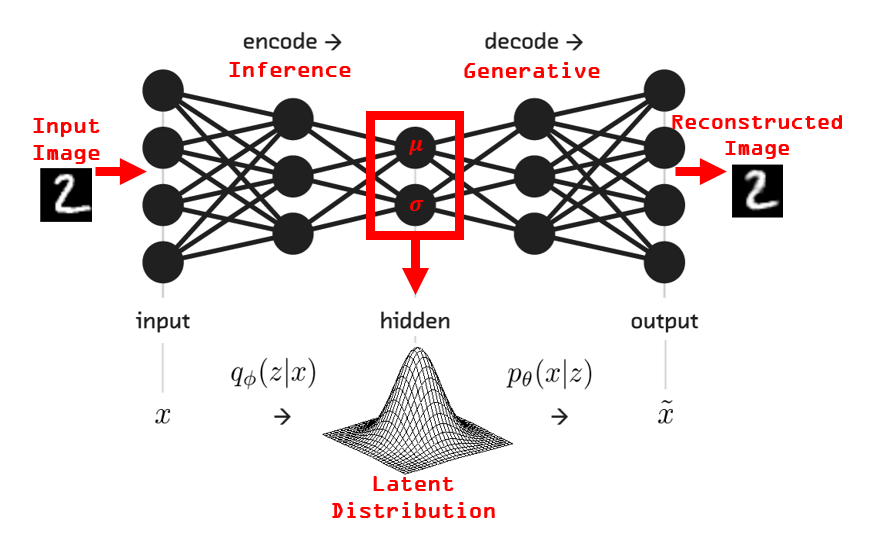
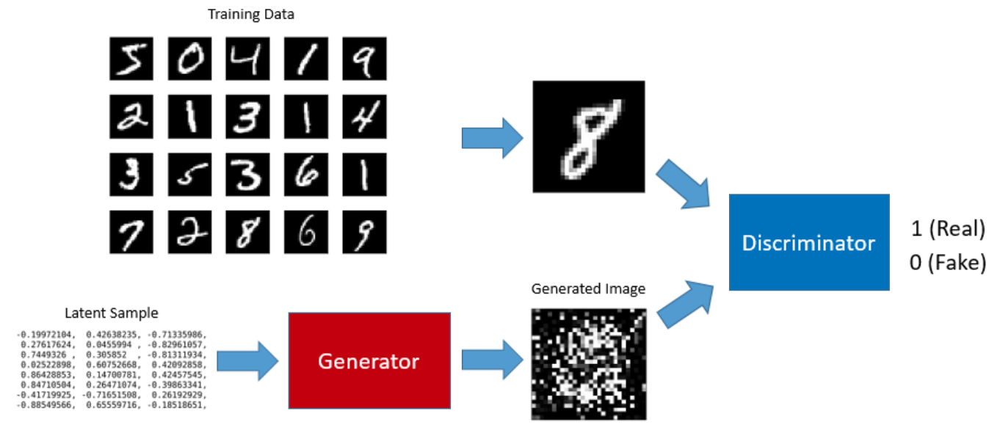
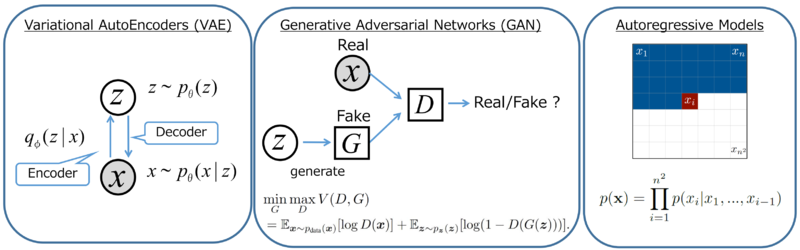

# Deep Generative Models

## Introduction
The world we live in is made up of rich 3D environments, containing interactive objects like people who walk, talk, and think, natural and artificial objects with specific features, and a lot more. Today, technology has allowed us to develop means to gather, store and disseminate huge amounts of such real world information, allowing us to develop special models that can analyze and understand this treasure of data. In this regard,  we will look at "Generative Models" in this lesson and see how these are different from the discriminative models in capturing and reproducing natural phenomena like visual objects, sounds and understanding complex data like written text etc. 

## Objectives

You will be able to:
- Understand the difference between discriminative and generative modeling techniques
- Describe the key research and development areas for deep generative models
- Provide real world examples of deep generative models for image/audio/text generation

## What are Generative Models ?

The intuition behind generative models can be best understood from Feynman's quote:

> ***“What I cannot create, I do not understand.”***

> Richard Feynman

Generative models require a large amount of data in some domain of interest (e.g., think millions of images, sentences, or sounds, etc.) and then train a model to generate new data which may appear as it came from the same distribution as the training data. When using neural networks as generative models, we usually have a large number of parameters significantly smaller than the amount of data we train them on. These models are trained in such a way as to discover and efficiently internalize the __essence__ of the training data in order to generate similar examples.

Generative models have some short-term applications in the areas of image processing and text analysis. In the longer run, these hold the potential to automatically learn the natural features of a dataset. 

[Visit this youtube link](https://www.youtube.com/watch?v=KeJINHjyzOU) for an interesting demonstration on advances in different deep generative models. 

## Discrimitive vs. Generative Models

The modeling approaches that we have seen so far in our course were primarily discriminative in nature as we attempted to model the decision boundary between the classes. In a discriminative model, we try to learn the conditional probability i.e., to predict the label `y` from the training example `x`, we must evaluate: 
$$f(x) = argmax_yP(y|x)$$

This merely chooses what is the most likely class `y` given `x`. So we are effectively trying to model the **decision boundary** between the classes. This behavior is very clear in neural networks, where the computed weights can be seen as a complexly shaped curve isolating the elements of a class in the space.

Now, using Bayes' rule, let's replace the $P(y|x)$ in the equation:

$$P(x|y)P(y)/P(x)$$

Since we are just interested in the $argmax$, we can ignore the denominator as that will be the same for every `y`. So we now have:

$$f(x) = argmax_yP(x|y)P(y)$$

which is the equation we use to develop generative models.

While in the first case we have the **conditional probability distribution $P(y|x)$**, which modeled the boundary between classes, in the second we have the **joint probability distribution $P(x, y)$**, since $P(x, y) = P(x | y) P(y)$, which explicitly models the actual distribution of each class.

With the joint probability distribution function, given a `y`, we can calculate ( or **"generate"**) its respective `x`. For this reason, they are called **Generative Models.**

> **A Generative Model explicitly models the actual distribution of each class**. 

*A Generative Model learns the joint probability distribution $P(x,y)$. It predicts the conditional probability with the help of Bayes Theorem. A Discriminative modellearns the conditional probability distribution $P(y|x)$. Both of these models were generally used in supervised learning problems.* 

An illustration of the difference between the generative and discriminative models in machine learning based on the wine classification problem. While the generative models learn the characteristics of each wine classes, the discriminative models rather learn the decision boundary between wine classes. 

## Generative Modeling Approaches

### Variational Autoencoders (VAEs)**
VAEs allow us to formalize the problem in the framework of probabilistic graphical models where we maximize a lower bound on the log likelihood of the data. Variational Autoencoders allow us to perform both learning and efficient Bayesian inference in sophisticated probabilistic graphical models with latent variables (e.g. see DRAW, or Attend Infer Repeat for hints of recent relatively complex models). However, their generated samples tend to be slightly blurry.

## Generative Adversarial Networks (GANs)
GANs handle the training process as a **game** between two separate networks: a generator network and a second discriminative network that tries to classify samples as either coming from the true distribution $P(x)$ or the model distribution $\hat{P}(x)$. Every time the discriminator notices a difference between the two distributions the generator adjusts its parameters slightly to make it go away, until at the end (in theory) the generator exactly reproduces the true data distribution and the discriminator is guessing at random, unable to find a difference. GANs currently generate the sharpest images but they are more difficult to optimize due to unstable training dynamics.

**Autoregressive Models** such as [PixelRNN](https://arxiv.org/abs/1601.06759) instead train a network that models the conditional distribution of every individual pixel given previous pixels. This is similar to plugging the pixels of the image into a char-rnn as we saw with seq2seq, but the RNNs run both horizontally and vertically over the image instead of just a 1D sequence of characters. PixelRNNs have a very simple and stable training process (softmax loss) and currently give the best log likelihoods (that is, plausibility of the generated data). However, they are relatively inefficient during sampling and don’t easily provide simple low-dimensional codes for images.

All of these models are active areas of research and hold a great promise for the future of generative modeling approaches. Here is a quick summary for these approaches:

In this section , we shall look at VAEs and GANs in a bit more detail. 

## Training Generative Models

Imagine a network setup to generate 200 images, each time starting with a different random code (latent dimension). We will come across following question: 

> How can we adjust the network’s parameters to make it produce slightly more believable samples in the future ?

One way around this problem could be to follow GAN approach by introducing a **discriminator** network (usually a standard convolutional neural network) that tries to classify if an input image is real or generated. We could feed the 200 generated images and 200 real images into the discriminator and train it as a standard classifier to distinguish between the two sources. Additionally, we can also **backpropagate** through both the discriminator and the generator to find how we should change the generator’s parameters to make its 200 samples slightly more confusing for the discriminator. These two networks are therefore playing a game: 
> the discriminator is trying to distinguish real images from fake images and the generator is trying to create images that make the discriminator think they are real. In the end, the generator network is outputting images that are indistinguishable from real images for the discriminator.

Another approach could be using VAE's to figure out the latent variable in terms of its data distribution ( rather than a latent vector as we saw in simple AEs). 

In both cases the samples from the generator start out noisy and chaotic, and over time converge to have more plausible image statistics. We will look into more details about these architectures in upcoming lessons. 

## Applications of Generative Models

You are required to visit following links to see examples of how generative models are doing a great job in performing advanced generative analysis in a number of domains. 

- [Google AI experiments](https://experiments.withgoogle.com/collection/ai)
- [Generate Movies Posters with Deep Convolutional Generative Adversarial Networks (DCGAN)](https://www.youtube.com/watch?v=Mb9ZNO_hXVY)

- [Generating songs with Neural Networks](https://www.youtube.com/watch?v=UWxfnNXlVy8)
- [Image Synthesis From Text With Deep Learning](https://www.youtube.com/watch?v=rAbhypxs1qQ)

- [Neural Network Joke Generator](https://www.youtube.com/watch?v=Aa8kERC1yXU)

- [Image Captioning](https://www.youtube.com/watch?v=f2waevH1b6I)

## Further Resources

- [Discriminative vs. Generative Models](http://www.ittc.ku.edu/~beckage/past_courses/ml738s17/5Bayesian.pdf)
- [Deep Generative Models](http://www.cs.toronto.edu/~urtasun/courses/CSC2541_Winter17/Deep_generative_models.pdf)
- [Nvidia’s Scary AI Generates Humans That Look 100% Real](https://www.tomsguide.com/us/nvidia-ai-faces-generative-adversarial-network,news-28869.html)

## Summary 

In lesson we introduced the notion of generative models and how they compare the discriminative models that we have seen so far in our course. We looked at some key architectures and application areas for deep generative models following a number of examples. Next we will look at VAEs and GANs into a bit more detail and see how such architectures can be built and trained in Keras. 
